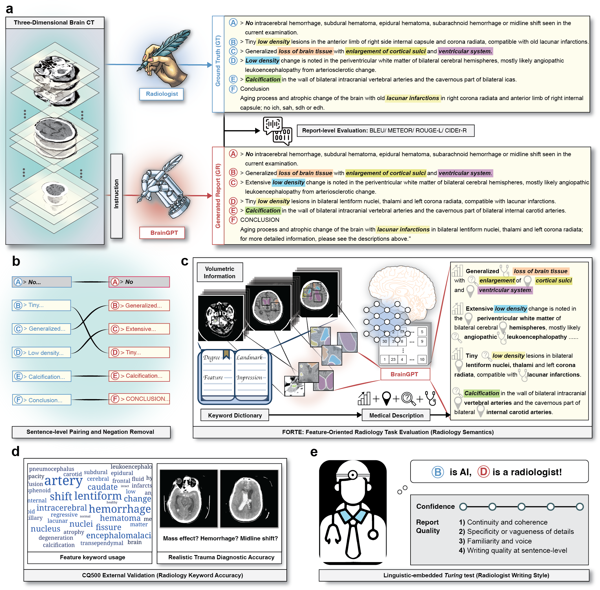

# Towards a Holistic Framework for Multimodal Large Language Models in Three-dimensional Brain CT Report Generation
<p align="center" width="100%">

</p>
[Paper Link](https://arxiv.org/abs/2407.02235)

## Code
> this repository is modified from https://github.com/Luodian/Otter

```
git clone https://github.com/charlierabea/FORTE.git

cd FORTE
```

## Set-up Environment
```
# GPU with RAM > 36GB is recommended since our checkpoint is 32.54 GB
conda env create -f environment.yml
# Otter: Install the pytorch that matches your cuda version. (e.g. cuda 11.7 torch 2.0.0). We have successfully run this code on cuda 11.1 torch 1.10.1 and cuda 11.7 torch 2.0.0. You can refer to PyTorch's documentation, Latest or Previous.
conda activate forte
pip install torch
pip install -r requirements.txt
# You may encounter error in installing Hovorod if your local "cmake" version is too old.
```

## Generate reports
### Download Files
Place both the base model [luodian/OTTER-MPT7B-Init](https://huggingface.co/luodian/OTTER-MPT7B-Init/tree/main) and our instruction-tuned model hf folder [https://huggingface.co/Charliebear/BrainGPT] at **./checkpoint/** folder

Place the CQ500 external validation dataset (image file [https://drive.google.com/file/d/1iDLx7NqvTg8sBTVViQu5wq8OhPSovAo4/view?usp=drive_link] at the **./data/** folder
```
bash ./eval.sh
```
The output excel file will appear at **./Evaluation/pipeline/train/output**

## Evaluation
### Download Files
BrainGPT is fine-tuned based on Otter ([luodian/OTTER-MPT7B-Init](https://huggingface.co/luodian/OTTER-MPT7B-Init))

Please place the FORTE keyword file [[https://docs.google.com/spreadsheets/d/1NtlDOHDoVNa_xrypH5J79_5ZxL-5mPzM/edit?usp=sharing&ouid=104290583109385210784&rtpof=true&sd=true](https://drive.google.com/file/d/1cSa9KYhfXShe7hveNmNXKif9K6SArOE0/view?usp=drive_link)] at **./data/** folder

### 1. Automatic Evaluation
```
python3 Automatic_evaluation.py
```
***Please remove the Spice scorer at /pycocoevalcap/eval.py work before running the code. The Spice scorer is not included in the automatic evaluation code. This may avoid potential error and reduce run time.***

```
        print('setting up scorers...')
        scorers = [
            (Bleu(4), ["Bleu_1", "Bleu_2", "Bleu_3", "Bleu_4"]),
            (Meteor(),"METEOR"),
            (Rouge(), "ROUGE_L"),
            (Cider(), "CIDEr"),
            # (Spice(), "SPICE")
        ]
```

### 2. Sentence pairing
```
python3 Sentence_pairing.py
```

### 3. FORTE Evaluation (Keyword lists for Brain CT/ Chest CT/ Abdomen CT/ Chest X-ray are provided)
```
python3 FORTE.py
```

### 4. Negation removal
```
python3 Negation_removal.py
```
